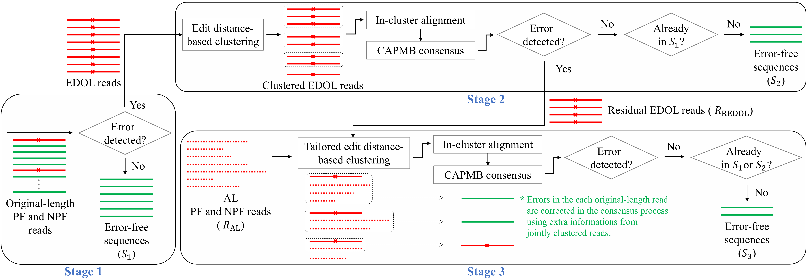

# Sequence analysis and decoding with extra low-quality reads for DNA data storage
This repository is for the study **"Sequence analysis and decoding with extra low-quality reads for DNA data storage"** which submitted to **_Bioinformatics_** in 2024.  
Here, we provide the source code and experimental sequencing data.  
(Current version was revised in Nov. 3, 2024)  

## Dataset
We performed Illumina NGS sequencing (MiSeq) with cycles 151-6-151 (R1-index-R2).  
Based on MiSeq [configurations](https://support.illumina.com/downloads/miseq-product-documentation.html), we obtain some raw sequencing data to get NPF (non-pass chastity filter) reads: cif, filter, and locs files.    
The provided data include all sequening reads: PF (pass filter), NPF, and reads with an invalid index. 

### Raw data
- *.cif (./dataset/raw/cif/)
- *.filter (./dataset/raw/filter/)
- *.locs (./dataset/raw/locs/)
  
  

### FASTQ 
- AYB-basecalled FASTQ (./dataset/fastq/AYB_fastq/)
- Illumina-basecalled FASTQ (./dataset/fastq/Illumina_fastq/)

## Sequence analysis and decoding (To be updated...)
Our sequence analysis workflow is shown in below figure.  

  

### Requirements
#### Languages
- Python  
- Matlab  
- C  

#### Open-source Software (used in proposed workflow and decoding)
- Edit distance based-clustering **[Starcode](https://github.com/gui11aume/starcode)**
- Sequence alignment **[MUSCLE](https://github.com/rcedgar/muscle)** (version 5.0.1428)
- Paired-end read merging **[PEAR](https://github.com/tseemann/PEAR)** (version 0.9.11)

### Run

## Contact
E-mail: wldus8677@gmail.com  
Homepage: [CICL](http://cctl.jnu.ac.kr/)  