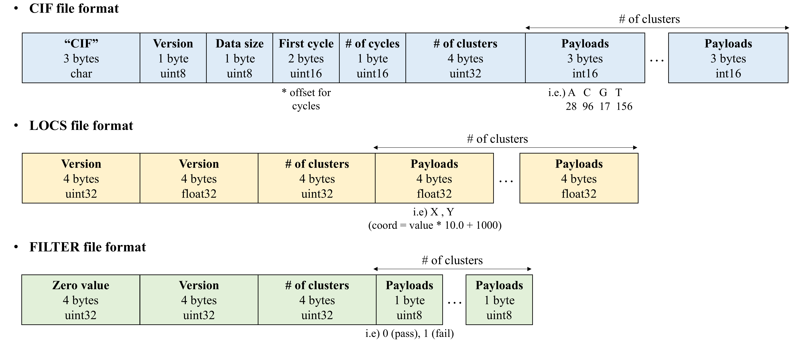

# Sequence analysis and decoding with extra low-quality reads for DNA data storage
This repository is for the study **"Sequence analysis and decoding with extra low-quality reads for DNA data storage"** which submitted to **_Bioinformatics_** in 2024.  
Here, we provide the source code and sequencing data.  
(Current version was revised in Nov. 5, 2024)  

## Dataset
We use pass filter (PF) reads and non-pass filter (NPF) reads of Illumina NGS sequencing.  
- PF: pass the chastity filter with an identified index pattern  
- NPF: fail to pass the filter  

NPF reads are not provided as FASTQ files in Illumina NGS sequencing.  
Therefore, we obtained raw sequencing data from Illumina sequencer and performed base-calling on NPF reads from the raw data.  

The detailed Illumina sequencing settings are described in [supplementary.docx](https://github.com/PParkJy/SAD-DNAstorage/blob/main/supplementary.docx) and the sequencing cycle is 151-6-151 (R1-index-R2).   
Based on MiSeq [configurations](https://support.illumina.com/downloads/miseq-product-documentation.html), we obtained the following raw sequencing data: cif, filter, and locs files.    

### Raw data (binary file)  
- *.cif (./dataset/raw/cif/): contains RTA image analysis results for one cycle and one tile.
- *.filter (./dataset/raw/filter/): contains chastity filter results for one tile.
- *.locs (./dataset/raw/locs/): contains cluster coordinates for one file.   

  

### FASTQ 
We conducted base-calling to generate FASTQ files from cif data using [AYB](https://github.com/timmassingham/AYB2/) with default options.   
Since the raw data includes not only PF and NPF reads but reads with a invalid index, we classified the reads using the FASTQ files produced by Illumina sequencing.  
The detailed method is described in README of "./dataset/".

- AYB-basecalled FASTQ (./dataset/AYB_fastq/)
- Illumina-basecalled FASTQ (./dataset/Illumina_fastq/)

We also provide the testset (FASTQ including PF and NPF reads) to use our method.  
- testset (./dataset/)

## Sequence analysis and decoding (updates in progress)
### Environments
#### Languages
- Python (3.7+)
- Matlab (with Communications Toolbox)
- C (gcc 7.5.0+)

#### Open-source Software
- Edit distance based-clustering **[Starcode](https://github.com/gui11aume/starcode)** (to be located in ./src/utils/starcode/)
- Sequence alignment **[MUSCLE](https://github.com/rcedgar/muscle)** (version 5.0.1428) (to be located in ./src/utils/MUSCLE/)
- Paired-end read merging **[PEAR](https://github.com/tseemann/PEAR)** (version 0.9.11) (to be located in ./src/utils/PEAR/)

### Run (./src/)
*All binary files require the execute permisson (+x)*  

#### Options
- **`<seed_num>`** 
  - unsigned int
  - Base seed of random generator 
- **`<sample_num>`** 
  - unsigned int
  - Random sampling number  
- **`<trial_num>`** 
  - unsigned int
  - Decoding trial index 
- **`<r1_filename>`** 
  - string without filename extenstion
  - FASTQ filename of R1 reads (must be located under ./dataset)  
- **`<r2_filename>`** 
  - string without filename extenstion
  - FASTQ filename of R2 reads (must be located under ./dataset)  
- **`<use_NPF>`** 
  - 0 or 1
  - 0 - use only PF reads
  - 1 - use PF + NPF reads 
- **`<len_org>`** 
  - unsigned int
  - Original length of an oligo sequence 
- **`<tau_e>`** 
  - unsigned int
  - Edit distence threshold of starcode
- **`<tau_adj>`** 
  - unsigned int 
  - Edit distance threshold of tailored edit distance-based clustering 
- **`<tau_sub>`** 
  - unsigned int
  - Substitution threshold of tailored edit distance-based clustering 
- **`<tau_del>`** 
  - unsigned int
  - Deletion threshold of tailored edit distance-based clustering 
- **`<tau_ins>`** 
  - unsigned int
  - Insertion threshold of tailored edit distance-based clustering 
- **`<len_min>`** 
  - unsigned int
  - Minimum length of AL reads 
- **`<len_max>`** 
  - unsigned int
  - Maximum length of AL reads 

#### Random sampling and merging
`bash sampling.sh <seed_num> <sample_num> <trial_num> <r1_filename> <r2_filename>`

#### Sequence analysis and decoding
*This process should be carried out after the "Random sampling and merging" process above.*  

First, we implemented the [Erlich](https://github.com/TeamErlich/dna-fountain)'s method.  
You can use it by `bash erlich.sh` with the following options.  
`bash erlich.sh <seed_num> <sample_num> <trial_num> <use_NPF> <len_org>`

Then, you can use our proposed method by `bash prop.sh` with the below options.   
This method should be used after `bash erlich.sh <seed_num> <sample_num> <trial_num> 1 <len_org>`   
`bash prop.sh <seed_num> <sample_num> <trial_num> <use_NPF> <tau_e> <tau_sub> <tau_del> <tau_ins> <tau_adj> <len_org> <len_min> <len_max>`  

The summation of `<tau_sub>`, `<tau_del>`, and `<tau_ins>` should be less than `<tau_adj>`.   
If you want to only set the edit distance threshold `<tau_adj>` without considering the each error threshold, you can run `prop.sh` with the below options. (default option)  
`bash prop.sh <seed_num> <sample_num> <trial_num> <use_NPF> <tau_e> 0 0 0 <tau_adj> <len_org> <len_min> <len_max>`  

## Contact
E-mail: wldus8677@gmail.com  
Homepage: [CICL](http://cctl.jnu.ac.kr/)  